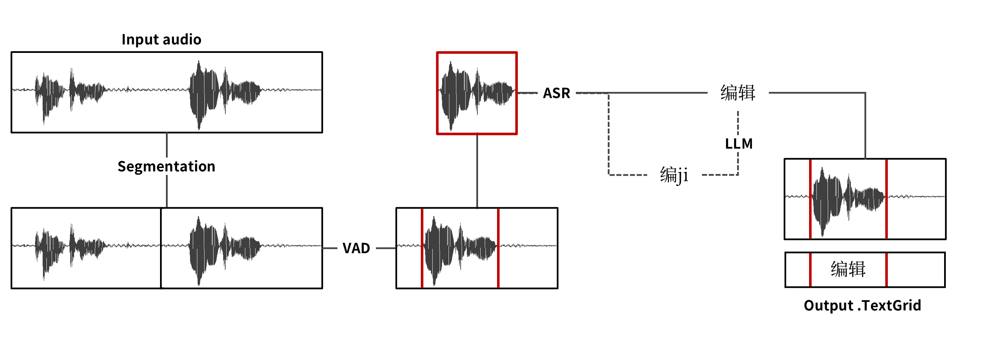

# Praasper
[](
https://pypi.org/project/praasper/)


***Praasper*** is an Automatic Speech Recognition (ASR) framework designed to help researchers transribe audio files to **utterance-level** text with decent level of accuracy in both transcriptoin and timestamps.



In ***Praasper***, we adopt a rather simple and straightforward pipeline to extract utterance-level information from audio files. The pipeline includes [***Praditor***](https://github.com/Paradeluxe/Praditor), [**SenseVoiceSmall (FunASR)**](https://github.com/modelscope/funasr) and **Qwen2.5-1.5B-Instruct**. 

For more information about supported languages, please refer to the [***FunASR***](https://github.com/modelscope/funasr) repository.


# How to use

Here is one of the **simplest** examples:

```python
import praasper

model = praasper.init_model()
model.annote("data")
```


Here are some other parameters you can pass to the `annote` method:

| Param | Default | Description |
| --- | --- | --- |
| `model_name` | iic/SenseVoiceSmall | Model name as the ASR core. Check out [**FunASR's model list**](https://github.com/modelscope/funasr?tab=readme-ov-file#model-zoo) for available models. |
| `input_path` | - | Path to the input audio file or folder. |
| `seg_dur` | 10. | Segment large audio into pieces, in seconds. |
| `min_pause` | 0.2 | Minimum pause duration between two utterances, in seconds. |
| `min_speech` | 0.2 | Minimum speech duration for an utterance, in seconds. |
| `language` | None | "zh" for Mandarin, "yue" for Cantonese, "en" for English, "ja" for Japanese, "ko" for Korean, and None for automatic language detection. |

Here is an code example indicating how you can use these parameters:
```python
import praasper

model = praasper.init_model(model_name="iic/SenseVoiceSmall")
model.annote(
    input_path="data",
    min_pause=.8,
    min_speech=.2,
    language=None,
    seg_dur=15.
)
```


## Cope with Praditor

***Praasper*** is embedded with a default set of parameters for ***Praditor***. But the default parameters may not be always optimal. In that case, you are recommended to use a custome set of parameters for ***Praditor***.

1. Use the lastest version of [***Praditor* (v1.3.1)**](https://github.com/Paradeluxe/Praditor/releases). It supports VAD.
2. Annotate the audio file. Fine-tune the parameters until the results fits your standard.

***Praditor*** will automatcally save a .txt param file to the same folder as the input audio file, with which ***Praasper*** will overrule the default params.


# Mechanism

**Praditor** is applied to perform **Voice Activity Detection (VAD)** algorithm to trim the currently existing word/character-level timestamps to **millisecond level**. It is a Speech Onset Detection (SOT) algorithm we developed for langauge researchers.

**SenseVoiceSmall** is used to transcribe the audio file, which does not offer timestamps. It is a lightweight ASR model compatible with even laptop. It has better support for short-length audio files, compared to *Whisper*.

In addition, in case that users want to designate one langauge throughout transcription, an additional **LLM** (`Qwen/Qwen2.5-1.5B-Instruct`) is added to the framework to correct potential deviation from

# Setup
## pip installation

```bash
pip install -U praasper
```
> If you have a succesful installation and don't care if there is GPU accelaration, you can stop it right here.


## GPU Acceleration (Windows/Linux)

Currently, ***Praasper*** utilizes `SenseVoiceSmall` from [`FunASR`](https://github.com/modelscope/funasr) as the ASR core.

> `FunASR` can automaticly detects the best currently available device to use. But you still need to first install GPU-support version `torch` in order to enable CUDA acceleration.

- For **macOS** users, only `CPU` is supported as the processing device.
- For **Windows/Linux** users, the priority order should be: `CUDA` -> `CPU`.

If you have no experience in installing `CUDA`, follow the steps below:


**First**, go to command line and check the latest CUDA version your system supports:

```bash
nvidia-smi
```

Results should pop up like this (It means that this device supports CUDA up to version 12.9).

```bash
| NVIDIA-SMI 576.80                 Driver Version: 576.80         CUDA Version: 12.9     |
```

**Next**, go to [**NVIDIA CUDA Toolkit**](https://developer.nvidia.com/cuda-toolkit) and download the latest version, or whichever version that fits your system/need.

**Lastly**, install `torch` that fits your CUDA version. Find the correct `pip` command [**in this link**](https://pytorch.org/get-started/locally/).

Here is an example for CUDA 12.9:

```bash
pip install --reinstall torch torchaudio --index-url https://download.pytorch.org/whl/cu129
```


## (Advanced) uv installation
`uv` is also highly recommended for way **FASTER** installation. First, make sure `uv` is installed to your default environment:

```bash
pip install uv
```

Then, create a virtual environment (e.g., .venv):

```bash
uv venv .venv
```

You should see a new `.venv` folder pops up in your project folder now. (You might also want to restart the terminal.)

Lastly, install `praasper` (by adding `uv` before `pip`):


```bash
uv pip install -U praasper
```

For `CUDA` support, here is an example for downloading `torch` that fits CUDA 12.9:

```bash
uv pip install --reinstall torch torchaudio --index-url https://download.pytorch.org/whl/cu129
```