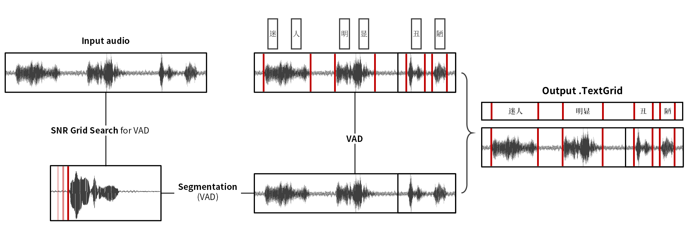

# Praasper
[](
https://pypi.org/project/praasper/)


[**Setup**](#setup) | [**Usage**](#how-to-use) | [**Mechanism**](#mechanism)

***Praasper*** is a speech processing framework designed to help researchers transcribe audio files into word-level timestamps — from a single word to a complete sentence — with high accuracy in both transcription and timestamps.



In ***Praasper***, the pipeline has three steps. First, **VAD** (*Praditor*) segments audio into chunks and extracts speech intervals with millisecond-level precision. Second, **ASR** (*Fun-ASR-Nano*) transcribes each chunk with word-level timestamps. Third, timestamps are aligned to VAD intervals and exported as a TextGrid file where each interval contains one word and its start/end time.

# How to use

Here is one of the **simplest** examples:

```python
import praasper

model = praasper.init_model()
model.annote("data_folder")
```

Here are the parameters you can pass to `init_model` and `annote`:

| Param | Default | Description |
| :---: | :---: | :--- |
| `ASR` | FunAudioLLM/Fun-ASR-Nano-2512 | Model ID for the ASR core. Check out [**FunASR's model list**](https://github.com/modelscope/funasr?tab=readme-ov-file#model-zoo) for available models. |
| `input_path` | - | Path to the folder where audio files are stored. |
| `seg_dur` | 10. | Segment large audio into pieces, in seconds. |
| `min_pause` | 0.2 | Minimum pause duration between two utterances, in seconds. |
| `language` | None | "zh" for Mandarin, "yue" for Cantonese, "en" for English, "ja" for Japanese, "ko" for Korean, and None for automatic language detection. |

Here is a code example showing how to use these parameters:

```python
import praasper

model = praasper.init_model(
    ASR="FunAudioLLM/Fun-ASR-Nano-2512"
)

model.annote(
    input_path="data_folder",
    min_pause=.8,
    seg_dur=15.
)
```

## Fine-tune *Praditor*

***Praasper*** is embedded with a default set of parameters for ***Praditor***. But the default parameters may not always be optimal. In that case, you are recommended to use a custom set of parameters for ***Praditor***.

1. Use the latest version of [***Praditor* (v1.3.1)**](https://github.com/Paradeluxe/Praditor/releases). It supports VAD.
2. Annotate the audio file. Fine-tune the parameters until the results fit your standard.
3. Click `Save` under the `Current` mode (top-right corner).

***Praditor*** will then save a `.txt` param file to the same folder as the input audio file, which ***Praasper*** will use to override the default params.

## ASR model recommendation

The default ASR model is `FunAudioLLM/Fun-ASR-Nano-2512`. It is a lightweight model that runs on laptop CPU and produces word-level timestamps. Other FunASR models can be used by passing the model name to the `ASR` parameter.

# Mechanism

***Praditor*** is applied to perform **Voice Activity Detection (VAD)** — it segments large audio files into smaller pieces and extracts speech intervals with **millisecond-level precision**. It was originally developed as a Speech Onset Detection (SOT) algorithm for language researchers.

**Fun-ASR-Nano** transcribes each audio chunk and provides word-level timestamps. It is lightweight enough to run on a laptop CPU, and supports multiple languages including Mandarin, Cantonese, English, Japanese, and Korean.

The VAD intervals and ASR timestamps are then aligned via overlap matching: each word from the ASR output is assigned to the VAD interval it overlaps with most. The result is exported as a TextGrid file where each interval contains one word with its start time, end time, and text.

# Setup

## pip installation

```bash
pip install -U praasper
```
> If you have a successful installation and don't care about GPU acceleration, you can stop right here.

## GPU Acceleration (Windows/Linux)

Currently, ***Praasper*** utilizes `Fun-ASR-Nano` from [**FunASR**](https://github.com/modelscope/funasr) as the ASR core.

> `FunASR` automatically detects the best currently available device to use. But you still need to first install the GPU-support version of `torch` in order to enable CUDA acceleration.

- For **macOS** users, only `CPU` is supported as the processing device.
- For **Windows/Linux** users, the priority order should be: `CUDA` -> `CPU`.

If you have no experience in installing `CUDA`, follow the steps below:

**First**, go to command line and check the latest CUDA version your system supports:

```bash
nvidia-smi
```

Results should pop up like this (It means that this device supports CUDA up to version 12.9).

```bash
| NVIDIA-SMI 576.80                 Driver Version: 576.80         CUDA Version: 12.9     |
```

**Next**, go to [**NVIDIA CUDA Toolkit**](https://developer.nvidia.com/cuda-toolkit) and download the latest version, or whichever version that fits your system/need.

**Lastly**, install `torch` that fits your CUDA version. Find the correct `pip` command [**in this link**](https://pytorch.org/get-started/locally/).

Here is an example for CUDA 12.9:

```bash
pip install --reinstall torch torchaudio --index-url https://download.pytorch.org/whl/cu129
```

## (Advanced) uv installation

`uv` is also highly recommended for a much **faster** installation. First, make sure `uv` is installed in your default environment:

```bash
pip install uv
```

Then, create a virtual environment (e.g., `.venv`):

```bash
uv venv .venv
```

You should see a new `.venv` folder appear in your project directory. (You may also want to restart the terminal.)

Lastly, install `praasper` (by prefixing `pip` with `uv`):

```bash
uv pip install -U praasper
```

For `CUDA` support, here is an example for downloading `torch` that fits CUDA 12.9:

```bash
uv pip install --reinstall torch torchaudio --index-url https://download.pytorch.org/whl/cu129
```
